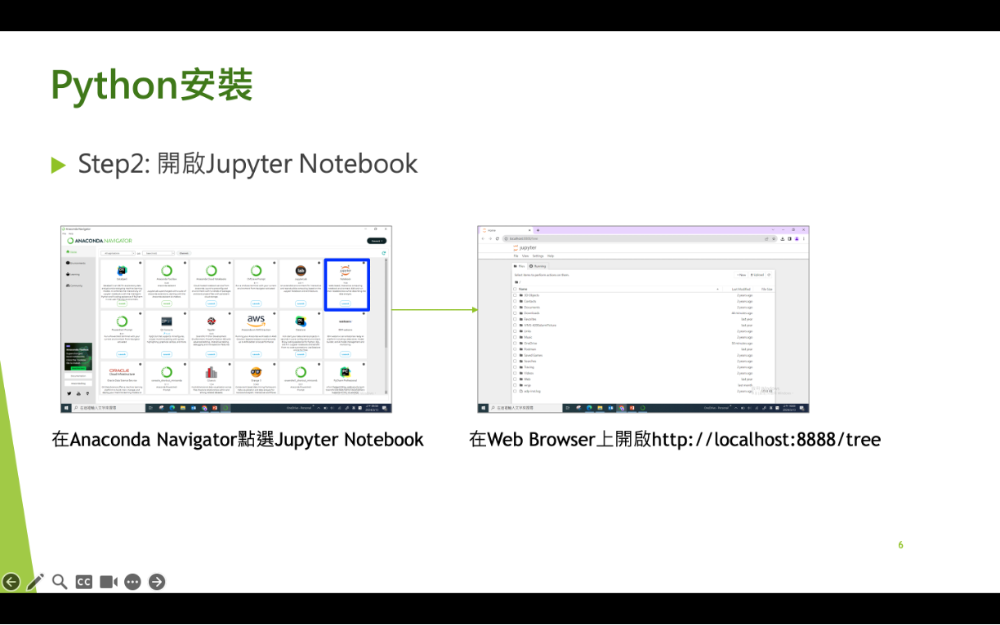

# Lab 0 - Python Setup


## 1. Install Anaconda
- download url: https://www.anaconda.com/download
- 現場可以找Debby or Jay 拿windows安裝檔 (Anaconda3-2024.02-1-Windows-x86_64.exe)


## 2. Launch Jupyter Notebook Service
- 點選Jupyter Notebook. 注意: 點一次就會開一個Service, 所以點第一次的時候, 會開第一個jupyter notebook service, url會是http://localhost:8888/tree, 點第二次的時候, 會開第二個jupyter notebook service, url會是http://localhost:8889/tree




- 如果點了很多次Jupyter Notebook, 可以使用powershell prompt查詢目前開的service

```shell
jupyter notebook list
```


## 3. 開啟jupyter notebook編輯器
- 打開網頁瀏覽器 (Chrome, Edge, Arc, Firefox, ...)
- 打開網址：http://localhost:8888/tree