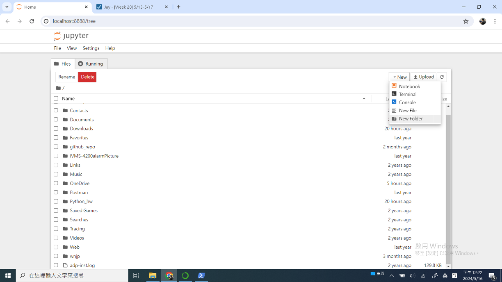
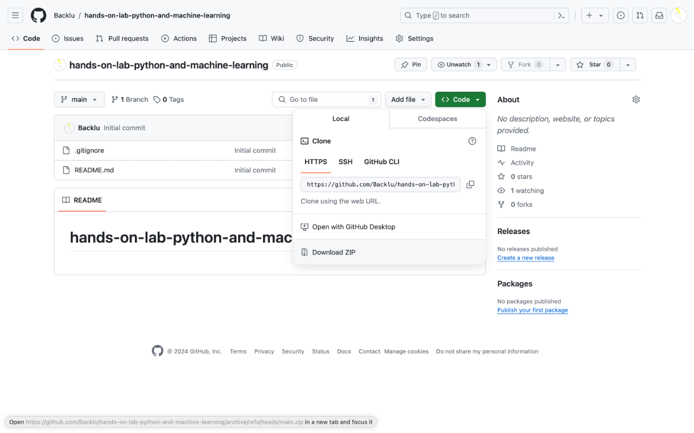
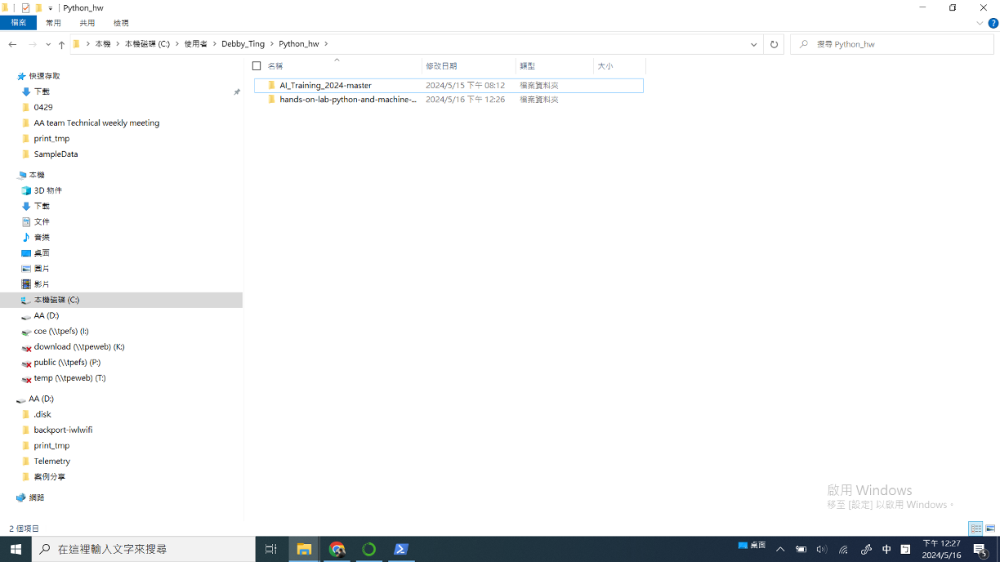
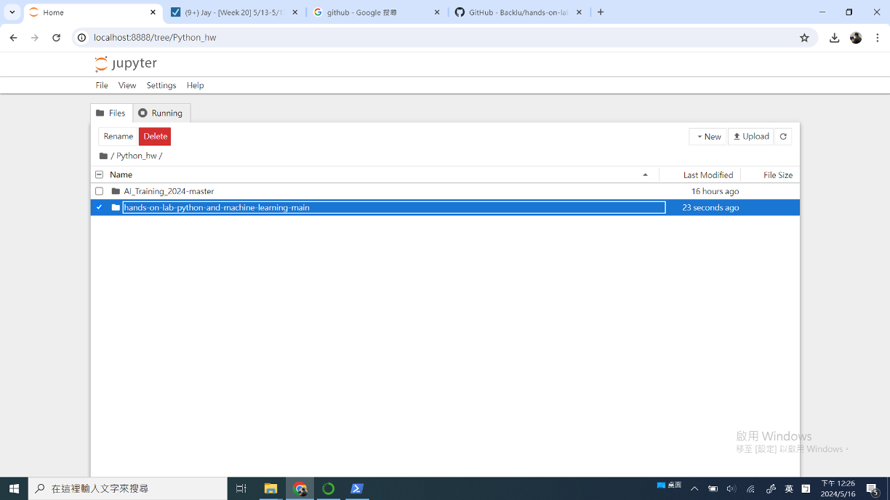
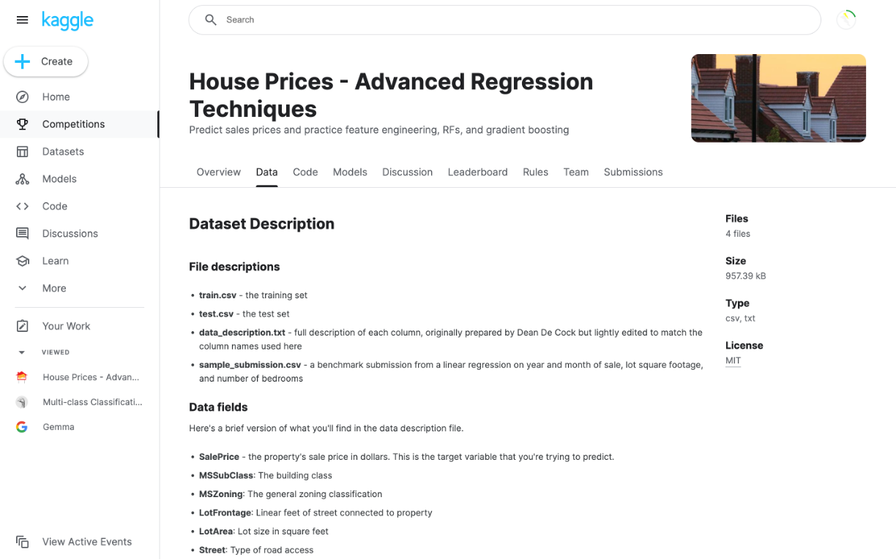
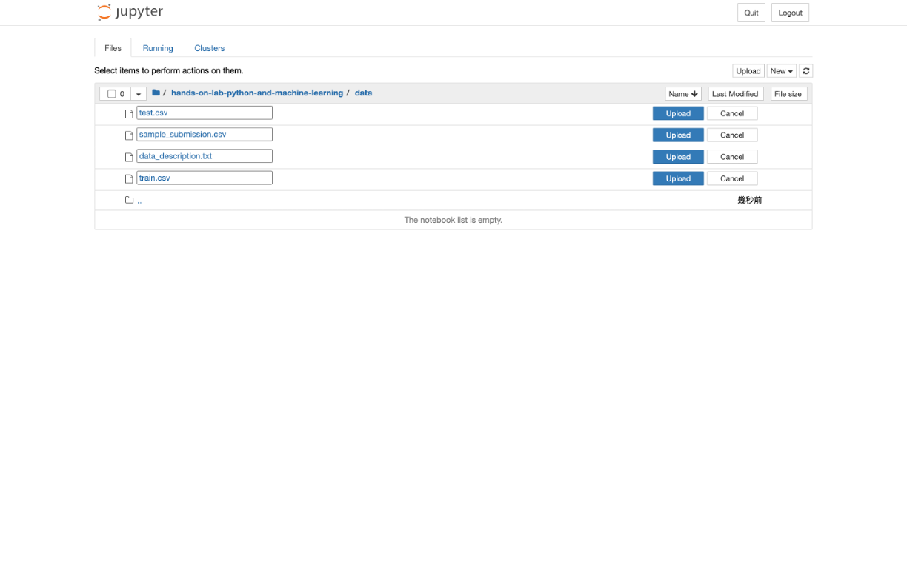

# Lab 1 - Download Source Code and Dataset

## 1. Create a working directory
創建一個工作資料夾, 以後各種python project都可以放在這個資料夾底下

## 2. Download or copy source code (zip file)
從github上下載source code, 也可以在現場找Jay or Debby copy (hands-on-lab-python-and-machine-learning-main.zip)
url: https://github.com/Backlu/hands-on-lab-python-and-machine-learning
    

unzip source code 
把source code資料夾整份放到上一步創建的工作資料夾下

這時候應該可以在jupyter notebook的頁面(http://localhost:8888/tree)看到source code資料夾

## 3. Download or copy dataset (csv file)
從kaggle網站上下載dataset, 也可以在現場找Jay or Debby copy (house-prices-advanced-regression-techniques.zip)
url: https://www.kaggle.com/competitions/house-prices-advanced-regression-techniques/data
    
    
    
unzip dataset
在jupyter notebook頁面的source code資料夾下創建一個data資料夾
把dataset資料夾整份放到上一步創建的data資料夾下
這時候應該可以在jupyter notebook的頁面看到data資料夾與裡面的csv files

    